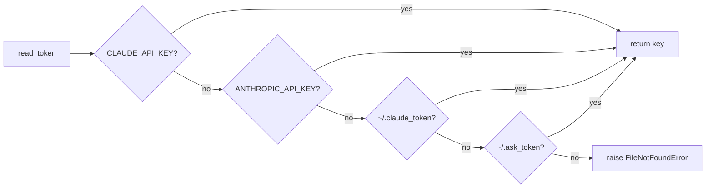
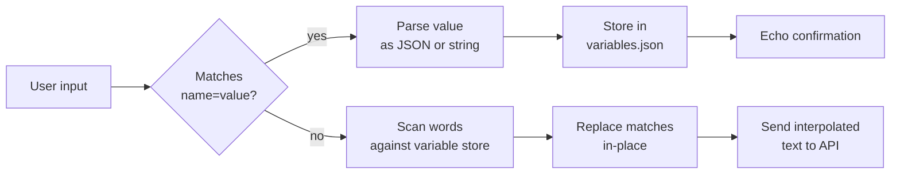
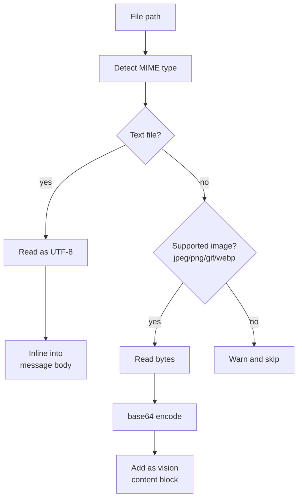
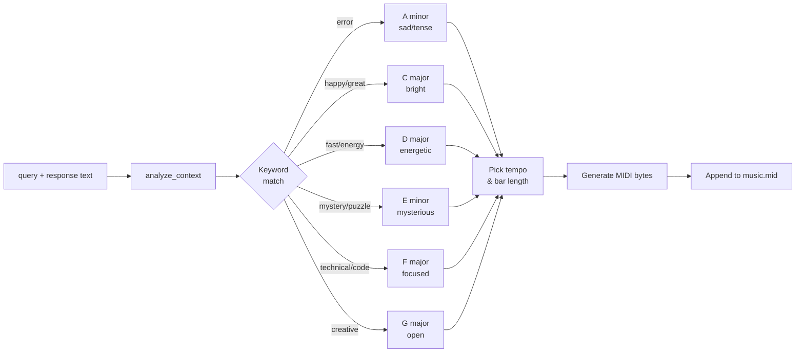
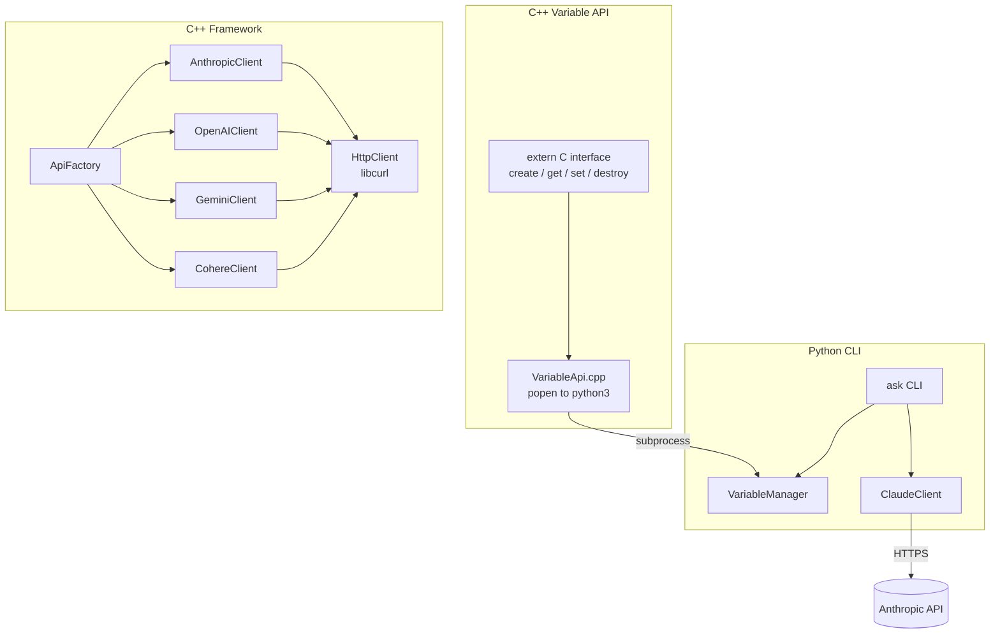
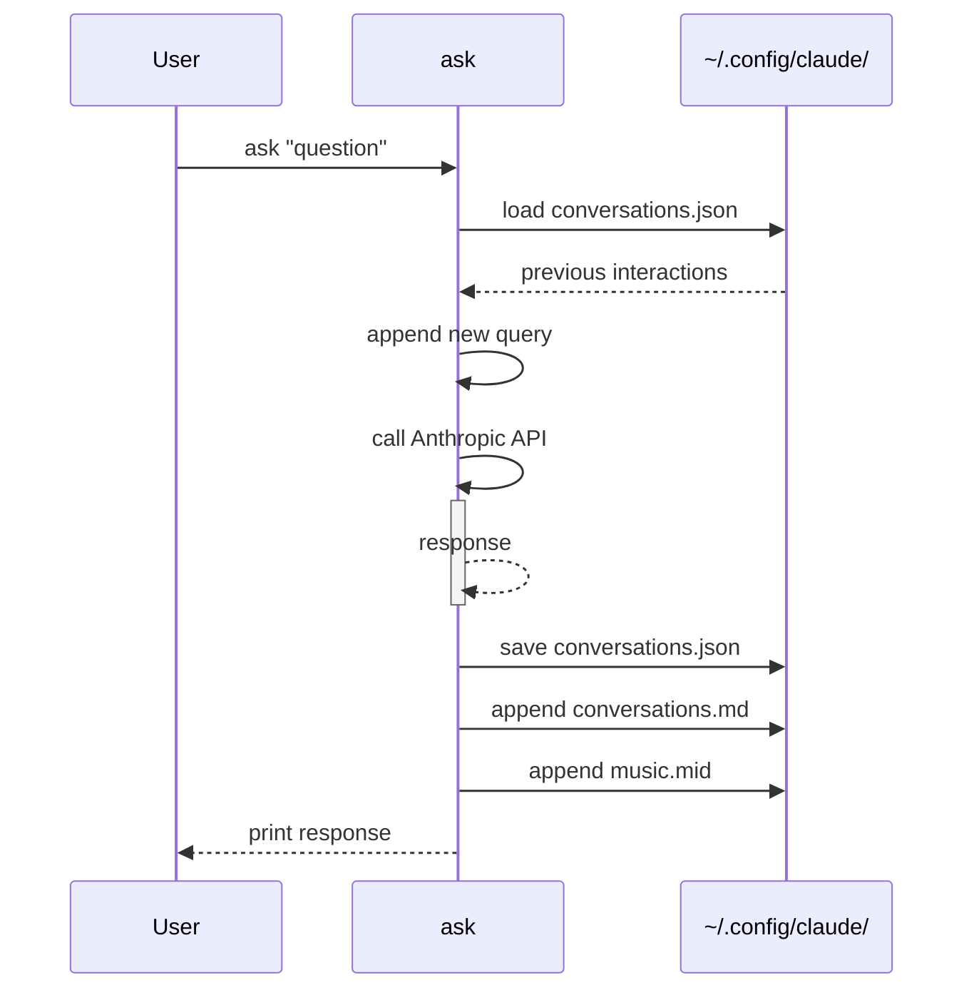

# Building ask: A Python/C++ CLI for Claude AI

I've been using large language models from the terminal for a while now, and every existing tool was either too minimal or too bloated. So I built my own: `ask`, a command-line interface for Anthropic's Claude that does what I want and nothing I don't.

Here's a tour of how it works and some of the more interesting design decisions along the way.

## The basic idea

```bash
ask "What's the time complexity of quicksort?"
ask --model claude-3-opus "Review this architecture decision"
cat error.log | ask - "What's causing this?"
```

No subcommands, no configuration wizards. If you pass an argument, it's a query. No arguments means interactive mode. Pipe into it with `-`. That's the interface.

Interactive mode uses `prompt_toolkit` for a proper readline-like experience with vi keybindings, history, and a bright green lambda prompt:

```
λ explain recursion to a five-year-old
λ now explain it to a senior engineer
```

Conversation history persists across sessions. Each exchange is stored in `~/.config/claude/conversations.json`, so follow-up questions work whether you're in interactive mode or firing off one-shot queries from the shell.

### Query flow

```mermaid
flowchart TD
    A([ask]) --> B{Arguments?}
    B -- yes --> C{Special flag?}
    B -- no --> D[Interactive mode]
    C -- --json / --model / etc --> E[One-shot query]
    C -- - --> F[Read from stdin]
    C -- --playsong --> G[Play MIDI]
    C -- --init-config --> H[Write config files]
    E --> I[ClaudeClient.generate_response]
    F --> I
    D --> J[PromptSession loop]
    J --> K{Input type?}
    K -- assignment --> L[VariableManager.set]
    K -- query --> I
    K -- upload --> M[prepare_files_for_upload]
    M --> I
    I --> N[Anthropic API]
    N --> O[Print response]
    O --> P[Append MIDI]
    O --> Q[Save conversation]
```

## API key lookup

The API key resolution order is intentionally flexible:

1. `CLAUDE_API_KEY` environment variable
2. `ANTHROPIC_API_KEY` environment variable
3. `~/.claude_token` file
4. `~/.ask_token` file (legacy fallback)

This means you can have a key in your shell profile, a per-project `.env` with `ANTHROPIC_API_KEY`, or just a token file — whatever fits your workflow.



## Variables that persist between sessions

One of the more useful features is a shell-like variable system. In interactive mode:

```
λ project=PyClaudeCli
Variable 'project' set to: PyClaudeCli

λ Write a one-paragraph summary of project for a job application
```

The word `project` in that prompt gets interpolated to `PyClaudeCli` before the query hits the API. Variables are stored as JSON in `~/.config/claude/variables.json` and survive across sessions.

```
λ vars
project = PyClaudeCli
lang = Python
tone = professional
```

The parser is straightforward: if input matches `identifier = value`, it's an assignment. Otherwise, variable names that appear as whole words in the text get replaced. JSON values work too — `config={"timeout": 30}` stores an object.

### Variable processing pipeline



## File uploads

```bash
ask upload architecture.png
ask upload -r ./src "Explain what this codebase does"
```

Text files get inlined into the message body. Binary image files (JPEG, PNG, GIF, WebP) get base64-encoded and sent as vision content. Everything else gets a warning. This separation keeps token usage predictable — you don't accidentally send a compiled binary as base64 noise.



## JSON output for scripting

```bash
ask --no-spinner --json "List five Linux commands for log analysis" | jq '.response'
```

The `--json` flag wraps the response in a structured object with `query`, `response`, and `model` fields. Combined with `--no-spinner`, `ask` becomes composable with standard Unix tooling.

## Multiline queries

Triple-quote syntax for longer prompts:

```bash
ask '''
You are reviewing a pull request. The diff is below.
Point out any issues with error handling.

$(git diff HEAD~1)
'''
```

Or use stdin for the same effect:

```bash
git diff HEAD~1 | ask - "Review this diff for error handling issues"
```

## MIDI generation (yes, really)

Each query generates a short MIDI sequence and appends it to `~/.config/claude/music.mid`. After a long session you have a piece of music that reflects the emotional arc of the work — technical deep-dives in F major, errors resolving to A minor, breakthroughs back to C major.

### Mood mapping

The query and response text gets scanned for keywords to pick a scale:

| Keywords | Scale | Character |
|----------|-------|-----------|
| happy, great, awesome | C major | bright |
| fast, quick, energy | D major | energetic |
| mystery, puzzle, unknown | E minor | mysterious |
| technical, code, function | F major | focused |
| creative, design, art | G major | open |
| error response | A minor | tense |



### Tempo and rhythm

Tempo is derived from a hash of the input text, so the same query always produces the same tempo — it's deterministic, not random. Bar length is chosen from 3, 5, or 9 beats, also hash-derived. The odd time signatures (5/4, 9/8) are a deliberate choice: they feel less mechanical than straight 4/4.

### Implementation

The MIDI is written in pure Python with no dependencies — just `struct.pack` writing bytes according to the MIDI 1.0 spec. A MIDI file is a surprisingly simple format once you strip away the tooling: a header chunk declaring the tempo and time signature, followed by track chunks containing note-on/note-off events with delta-time offsets.

Each session appends to the same file up to a 500KB cap, at which point the oldest bars are dropped. The file accumulates across sessions until you explicitly clear it.

```bash
ask --playsong          # Play the accumulated song
ask --playsong --loop   # Loop it
ask --gen-midi "text"   # Generate from arbitrary text
ask --clear-music       # Start fresh
```

## The C++ layer

The project has two C++ components that sit alongside the Python CLI.



**The Variable API** (`ask/bindings/VariableApi.cpp`) exposes the Python variable system to C++ and other languages via a C FFI:

```c
VariableManager* vm = create_variable_manager(NULL);
set_variable(vm, "name", "Alice");
const char* val = get_variable(vm, "name");  // "Alice"
destroy_variable_manager(vm);
```

The implementation is intentionally simple: it uses `popen()` to shell out to `python3 -c "..."` rather than embedding a Python interpreter. This keeps the C++ code small and the Python variable system as the single source of truth.

**The multi-provider framework** (`src/`) is a more ambitious piece: a C++23 HTTP client with a factory pattern for Anthropic, OpenAI, Gemini, and Cohere. It uses libcurl for HTTP and nlohmann/json for parsing, with a clean `IApiClient` interface and typed exception hierarchy. It's fully built but currently independent of the CLI — more a foundation for future native tooling than something the Python code calls into.

Both are built with CMake, and `./b` builds everything and runs the full test suite:

```
Building all targets ... ok
Running unit tests (80 tests) ... ok
Running integration tests (9 tests) ... ok
Build completed successfully!
```

## Configuration

Running `ask --init-config` creates a set of files under `~/.config/claude/`:

| File | Purpose |
|------|---------|
| `system` | Custom system prompt prepended to every conversation |
| `models.json` | Default model, timeouts, music settings |
| `aliases.json` | Command shortcuts |
| `templates.json` | Reusable prompt templates |

The custom system prompt is the most useful of these. Drop your preferred persona or constraints in `~/.config/claude/system` and every session uses it automatically.

### Conversation persistence



## What I'd do differently

The conversation history format has evolved a few times and carries some legacy cruft — the loader checks three different file locations in sequence. That should be cleaned up into a single migration path.

The MIDI feature is fun but the `popen()`-based C++ variable bridge is a leaky abstraction that would benefit from proper Python/C API bindings or pybind11 if the C++ layer grows.

The C++ multi-provider framework and the Python CLI are currently completely separate. Wiring them together — having the Python CLI optionally delegate HTTP calls to the C++ layer for performance — would be an interesting direction.

## Source

The project is on GitHub: [cschladetsch/PyClaudeCli](https://github.com/cschladetsch/PyClaudeCli)

```bash
git clone https://github.com/cschladetsch/PyClaudeCli
cd PyClaudeCli
pip install -e .
export ANTHROPIC_API_KEY="sk-ant-..."
ask
```
