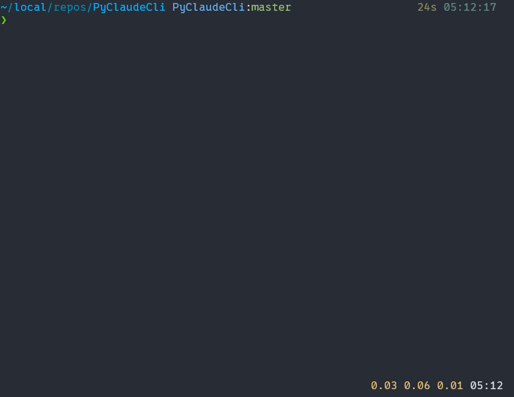

# Claude CLI

<div align="center">
  
  <p><em>A powerful command-line interface for interacting with Claude AI models</em></p>
</div>

## Overview

Claude CLI provides a seamless, terminal-based interface to interact with Anthropic's Claude AI models. It combines the power of Claude's advanced reasoning capabilities with the efficiency of a command-line workflow, perfect for developers, researchers, and power users.

## Features

- **Interactive Mode**: Engage in continuous conversations with Claude through a responsive terminal interface
- **Command-Line Mode**: Quick queries without entering the interactive environment
- **Vim-Style Key Bindings**: Familiar navigation and editing for power users
- **Conversation Management**: Save, view, and clear conversation history
- **File Upload Support**: Share files with Claude for analysis, with intelligent handling of both text and image files
- **Rich Terminal UI**: Color-coded output and animated progress indicators
- **Context Preservation**: Maintain conversation context for more coherent exchanges

## Installation

### Prerequisites

- Python 3.8+
- Anthropic API key

### Quick Install

```bash
# Clone the repository
git clone https://github.com/yourusername/claude-cli.git
cd claude-cli

# Create a virtual environment (recommended)
python -m venv .venv
source .venv/bin/activate  # On Windows: .venv\Scripts\activate

# Install dependencies
pip install -r requirements.txt

# Set up your API key
echo "your-anthropic-api-key" > ~/.claude_token
# Or set environment variable: export CLAUDE_API_KEY="your-anthropic-api-key"

# Optional: Install in development mode
pip install -e .
```

## Usage

### Interactive Mode

Launch the interactive mode by running the command without arguments:

```bash
ai
```

This opens a prompt where you can chat with Claude continuously.

#### Available Commands in Interactive Mode

| Command | Description |
|---------|-------------|
| `help`, `?` | Show available commands |
| `h` | Show command history |
| `h N` | Show last N commands from history |
| `c` | Show conversation history |
| `c N` | Show last N exchanges from conversation |
| `clear` | Clear conversation history |
| `upload <file1> [file2] ...` | Upload files to analyze |
| `exit`, `quit` | Exit the program |

#### Upload Command Options

```bash
# Upload a single file
upload document.md

# Upload multiple files
upload document.md image.png code.py

# Upload all files in a directory (recursive)
upload --recursive ./project/

# Or use the short form
upload -r ./project/
```

### Command-Line Mode

For quick, one-off queries without entering interactive mode:

```bash
# Ask a question
ai "What is the capital of France?"

# Clear conversation history
ai clear

# Show conversation history
ai c
# or
ai conversation

# Upload files for analysis
ai upload document.md image.png
```

## File Handling

Claude CLI intelligently handles different file types:

- **Text Files** (markdown, code, txt, etc.): Content is extracted and included directly in the message to Claude
- **Image Files** (jpeg, png, gif, webp): Sent as attachments via the Claude API
- **Unsupported Files**: Warning message is displayed, and file is skipped

## Configuration

### API Key

You can provide your Claude API key in either of two ways:

1. **Environment Variable**:
   ```bash
   export CLAUDE_API_KEY="your-api-key-here"
   ```

2. **Token File**:
   ```bash
   echo "your-api-key-here" > ~/.claude_token
   ```

### Data Storage

The CLI maintains several files:

| File | Purpose |
|------|---------|
| `~/.ai_history` | Command history |
| `~/.ai_conversation_state.json` | Conversation state |
| `~/.ai_uploads` | Temporary cache for uploaded files |
| `~/.ai_token` | API token (if not using environment variable) |

Legacy paths with `.claude_` prefix are also supported for backward compatibility.

## Advanced Usage

### Using with Unix Pipes

Claude CLI works well with Unix pipes, allowing integration into complex workflows:

```bash
# Analyze the output of a command
ls -la | ai "Analyze this directory listing and identify large files"

# Analyze a file's content
cat complex_code.py | ai "Explain what this code does"
```

### Shell Function Integration

You can create shell functions for common operations:

```bash
# Add to your .bashrc or .zshrc
function explain() {
  cat "$1" | ai "Explain this code step by step"
}

# Then use like:
explain complex_algorithm.py
```

## Project Structure

```
claude-cli/
ÃÄÄ ai/
³   ÃÄÄ __init__.py
³   ÃÄÄ __main__.py
³   ÃÄÄ cli.py            # Main CLI handling
³   ÃÄÄ constants.py      # Configuration constants
³   ÃÄÄ api/
³   ³   ÀÄÄ client.py     # Claude API wrapper
³   ÃÄÄ modes/
³   ³   ÀÄÄ interactive.py # Interactive mode
³   ÀÄÄ utils/
³       ÃÄÄ colors.py     # Terminal color utilities
³       ÃÄÄ io.py         # File I/O operations
³       ÀÄÄ spinner.py    # Progress animation
ÃÄÄ requirements.txt
ÃÄÄ setup.py
ÀÄÄ resources/
    ÀÄÄ Demo.gif
```

## Troubleshooting

### API Key Not Found

If you see "Token file not found and 'CLAUDE_API_KEY' environment variable is not set":

1. Create a token file: `echo "your-api-key" > ~/.claude_token`
2. Or set the environment variable: `export CLAUDE_API_KEY="your-api-key"`

### File Upload Issues

For "File type not supported" errors with text files, ensure you have the latest version with proper text file handling.

## Contributing

Contributions are welcome! Please feel free to submit a pull request.

1. Fork the repository
2. Create your feature branch: `git checkout -b feature/amazing-feature`
3. Commit your changes: `git commit -m 'Add some amazing feature'`
4. Push to the branch: `git push origin feature/amazing-feature`
5. Open a Pull Request

## License

This project is licensed under the MIT License - see the LICENSE file for details.

## Acknowledgments

- [Anthropic](https://www.anthropic.com/) for creating Claude
- The Python community for excellent libraries like prompt_toolkit

---

<div align="center">
  <p>Made with ?? for the Claude community</p>
</div>
